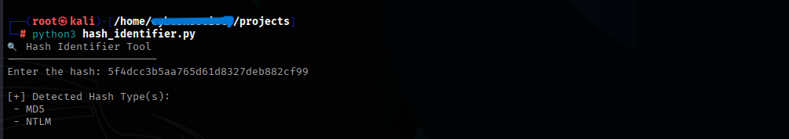

# 🔐 Hash Identifier Tool

A simple Python-based tool to identify common hash types based on their pattern and length. This tool helps in recognizing the hashing algorithm used for a given hash string.

---

## 📌 About the Project

Hashing is a critical part of cybersecurity — whether in password storage, data integrity, or digital signatures. This **Hash Identifier Tool** takes a hash string as input and predicts the most likely hashing algorithm(s) used.

It is extremely useful during CTF challenges, password cracking, digital forensics, or during recon in bug bounty hunting.

---

## ⚙️ Features

- Supports popular hash types like:
  - MD5
  - SHA1, SHA224, SHA256, SHA384, SHA512
  - SHA3 variants
  - Blake2b, Blake2s
  - NTLM, MySQL, and more
- Detects based on hash length and structure
- Easy to use from command line
- Lightweight and dependency-free

---

## 💻 Usage

```bash
python3 hash_identifier.py
````

Then enter the hash when prompted.

### 🔍 Example:

```bash
Enter the hash: 5f4dcc3b5aa765d61d8327deb882cf99
```

Output:

```
[+] Possible Hash Algorithms:
- MD5
```




---

## 🧠 How It Works

The script uses **hash length and character patterns** to identify the type of hash. For example:

* MD5 → 32 hex characters
* SHA1 → 40 hex characters
* SHA256 → 64 hex characters
* SHA512 → 128 hex characters
* NTLM → 32 hex characters (but typically uppercase)
* MySQL → 16 or 41 characters with certain patterns

The tool matches these lengths and regex patterns to identify all possible matches. It is not 100% accurate, but highly effective for known hashes.

---

## 📦 Requirements

* Python 3.x
* No external libraries required

---

## 📂 Output Example

```text
Enter the hash: $2y$10$9iKtccZ5uTj7DfG0CBzGhu4UzZrZYz0J0QJ0hh1SMfNckO1rkP2Hq

[+] Possible Hash Algorithms:
- bcrypt
```

---

## 🏁 Getting Started

1. Clone this repository:

```bash
git clone https://github.com/bhavesh-pardhi/My-CyberSecurity-Projects.git
cd My-CyberSecurity-Projects/Hash-Identifier
```

2. Run the tool:

```bash
python3 hash_identifier.py
```

3. Enter a hash string to get predictions.

---

## 🎯 When to Use

* During CTFs or cybersecurity competitions
* While performing digital forensics
* In red/blue team scenarios
* For checking unknown hashes found in databases or config files

---

## 📜 License

This project is licensed under the MIT License — use it freely for educational or practical purposes. Credit is appreciated 🙌

---

## ✨ Made with ❤️ by [Bhavesh Pardhi](https://github.com/bhavesh-pardhi)

```
