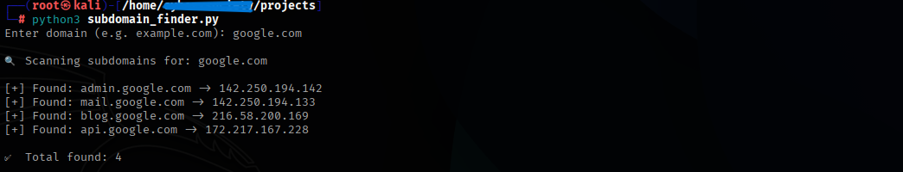

# 🔍 Subdomain Finder Tool – Discover Hidden Subdomains with Python

Welcome to the **Subdomain Finder**, a beginner-friendly tool developed in Python to help you identify subdomains of any target domain. This is a simple but powerful reconnaissance tool that is often used in the first step of ethical hacking and bug bounty hunting.

This project is part of my collection at:
👉 [My-CyberSecurity-Projects](https://github.com/bhavesh-pardhi/My-CyberSecurity-Projects)

---

## 📖 About the Project

Subdomains are like mini-websites under a main website. For example:

- `mail.google.com`
- `support.microsoft.com`
- `admin.facebook.com`

Often, organizations forget to secure all their subdomains, which makes them a common entry point for hackers. This tool takes a list of common subdomain names and checks which ones actually exist for a given domain using DNS resolution.

With this project, you will:

- Learn basic Python scripting
- Understand how DNS resolution works
- Practice your recon skills for real-world bug bounty hunting

---

## 🧠 How It Works (Step by Step)

1. **Input the Target Domain**  
   The tool asks for a domain like `example.com`.

2. **Load the Wordlist**  
   It reads from a file called `subdomains.txt`, which contains possible subdomain names like `admin`, `test`, `mail`, `dev`, etc.

3. **Create Full Subdomain URLs**  
   It combines each word with the main domain (e.g. `admin.example.com`).

4. **Check if Subdomain Exists**  
   Using Python's `socket` module, it tries to resolve the subdomain. If successful, the subdomain exists.

5. **Output the Results**  
   All valid subdomains are printed with their IP addresses.

---

## 🛠️ Features

- ✅ Written in pure Python (no external libraries)
- ✅ Uses DNS resolution to verify subdomains
- ✅ Works offline (with a wordlist)
- ✅ Simple and beginner-friendly code
- ✅ Helpful for bug bounty, pentesting, and recon

---

## 📦 Files Included

```

subdomain-finder/
├── subdomain_finder.py     ← Main Python script
└── subdomains.txt          ← Wordlist file for subdomains

````

---

## 🔧 Requirements

- Python 3.x installed
- A subdomain wordlist (included: `subdomains.txt`)

You do **not** need to install any extra libraries.

---

## 🚀 How to Use

1. **Clone the Repository or Download the Files**

```bash
git clone https://github.com/bhavesh-pardhi/My-CyberSecurity-Projects
cd My-CyberSecurity-Projects/Subdomain-Finder
````

2. **Edit `subdomains.txt`**
   Add or remove subdomain names you want to check.

Example contents:

```
admin
mail
test
dev
blog
support
```

ADD YOUR SUBDOMAINS

3. **Run the Script**

```bash
python3 subdomain_finder.py
```

4. **Enter a Domain**

```bash
Enter domain (e.g. example.com): google.com
```

5. **See the Results**

```bash
[+] Found: mail.google.com → 142.250.195.133
[+] Found: blog.google.com → 172.217.0.1

✅ Total found: 2
```

---

## 🧪 Example Output



---

## 🎯 Use Cases

* 🔍 Recon in bug bounty hunting
* 🛡️ Footprinting in ethical hacking
* 📚 Learning DNS and networking basics
* 🧪 Practice for beginners in cybersecurity

---

## 🧠 How the Code Works (In Simple Words)

Here’s what the code is doing behind the scenes:

* `socket.gethostbyname()` → This function tries to find the IP of a domain. If it fails, that subdomain does not exist.
* The script uses a loop to try each subdomain in the wordlist.
* When a subdomain works, it prints it and saves the IP.
* Errors are handled quietly so it doesn’t crash if a subdomain is invalid.

This helps you understand how subdomain enumeration works in real life and prepares you for advanced tools like `Sublist3r`, `Amass`, and `Assetfinder`.

---

## ⚠️ Disclaimer

This tool is created for **educational purposes only**. Do not use it on websites without proper authorization. Always follow ethical hacking guidelines.

---

## 🤝 Contribution

This is a beginner project. If you want to improve it with:

* Wordlist options
* Threading for faster results
* Exporting to file (CSV, JSON, etc.)

Feel free to fork and make a pull request!

---

## 📌 Explore More

Check out the rest of my cybersecurity tools here:
👉 [My-CyberSecurity-Projects](https://github.com/bhavesh-pardhi/My-CyberSecurity-Projects)

---

## 🙌 Made with ❤️ by Bhavesh Pardhi

Let us learn, build, and secure the web together!
